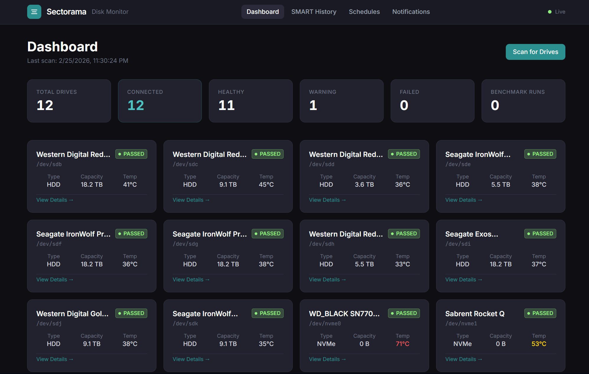
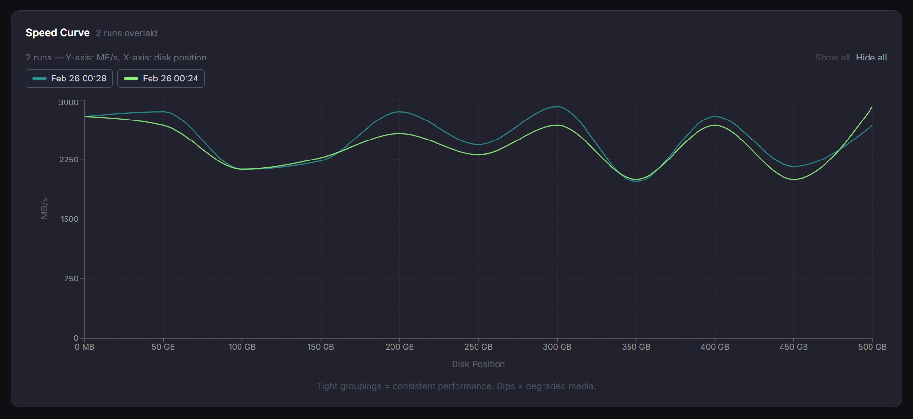
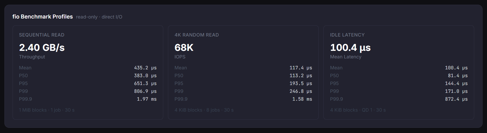

# Sectorama

**Self-hosted disk benchmark and health monitor.**

Sectorama discovers your drives, runs comprehensive fio benchmarks (position curve + I/O profiles), polls SMART
attributes on a schedule, and surfaces everything through a clean React dashboard — all from a single Docker container
on your own hardware.

[](https://github.com/tabilzad/sectorama/actions/workflows/ci.yml)
[](https://hub.docker.com/r/tabilzad/sectorama)
[](https://www.gnu.org/licenses/gpl-3.0)

---

<div align="center">
  
  <p><em>Dashboard showing 12 drives with live SMART health badges, temperatures, type, and capacity at a glance.</em></p>
</div>

<div align="center">
  
  <p><em>Historical speed curve to track performance overtime </em></p>
</div>

<div align="center">
  
  <p><em>Latency, sequential and random read statistics</em></p>
</div>

---

## Features

- **Drive discovery** — auto-detects all block devices via `smartctl --scan`
- **Position curve** — measures sequential read speed at evenly-spaced byte offsets to visualise the speed falloff from
  outer to inner tracks
- **fio profiles** — three standard benchmark profiles per run:
    - Sequential read (1 MiB blocks, 30 s)
    - 4 K random read (8 parallel jobs, 30 s)
    - Idle latency (P50 / P95 / P99 / P99.9 ns)
- **SMART history** — scheduled polling stored in InfluxDB; attribute trends charted over time
- **Benchmark schedules** — cron-based per-drive or global schedules
- **Notifications** — alert channels (Webhook, Slack) with per-alert-type subscriptions; transition-only firing (once on
  condition onset, silent until it clears and re-triggers); per-drive temperature threshold overrides
- **Live feed** — WebSocket push for real-time benchmark progress and health alerts
- **Dark UI** — React + Tailwind dashboard; fully responsive

---

## Quick Start (Docker Compose)

### 1. Copy the compose file

```bash
curl -O https://raw.githubusercontent.com/tabilzad/sectorama/master/docker-compose.yml
```

### 2. Set required secrets

```bash
export INFLUXDB_TOKEN=change-me-strong-random-secret
# optional — defaults shown
export INFLUXDB_ADMIN_PASSWORD=adminpass
export SMART_POLL_INTERVAL_MINUTES=5
export BENCHMARK_NUM_POINTS=11
```

### 3. Start

```bash
docker compose up -d
```

Open **http://localhost:8888**, click **Scan for Drives**, then run a benchmark from any drive's detail page.

> **Note:** The container runs `privileged` and mounts `/dev` read-only so that `smartctl` and `fio` can access raw
> block devices. Do not expose port 8888 to the public internet.

---

## Development Setup

```bash
# 1. Clone
git clone https://github.com/tabilzad/sectorama.git
cd sectorama

# 2. Install workspace dependencies
npm install

# 3. Start InfluxDB sidecar
docker compose -f docker-compose.dev.yml up -d

# 4. Configure environment
cp .env.example .env
# On Windows/macOS: add DISK_DISCOVERY_MOCK=true to .env

# 5. Run (backend :8888, frontend :5173 with HMR)
npm run dev
```

### Build

```bash
npm run build       # compiles shared → backend → frontend
npm run typecheck   # type-check all workspaces without emitting
```

---

## Environment Variables

| Variable                              | Default                 | Description                                                       |
|---------------------------------------|-------------------------|-------------------------------------------------------------------|
| `PORT`                                | `8888`                  | HTTP port the backend listens on                                  |
| `SQLITE_PATH`                         | `./sectorama.db`        | Path to the SQLite database file                                  |
| `INFLUXDB_URL`                        | `http://localhost:8086` | InfluxDB v2 base URL                                              |
| `INFLUXDB_TOKEN`                      | _(required)_            | InfluxDB API token                                                |
| `INFLUXDB_ORG`                        | `sectorama`             | InfluxDB organisation                                             |
| `INFLUXDB_BUCKET`                     | `sectorama`             | InfluxDB bucket                                                   |
| `INFLUXDB_ADMIN_PASSWORD`             | `adminpass`             | Admin password for the bundled InfluxDB service                   |
| `SMART_POLL_INTERVAL_MINUTES`         | `5`                     | SMART polling interval                                            |
| `BENCHMARK_NUM_POINTS`                | `11`                    | Number of positions sampled in each position-curve run            |
| `DISK_DISCOVERY_MOCK`                 | `false`                 | Return synthetic drives/SMART/benchmark data (Windows/macOS dev)  |
| `TEMPERATURE_ALERT_THRESHOLD_CELSIUS` | `50`                    | Global default temperature alert threshold; overridable per drive |

---

### Data stores

| Store                         | What lives there                                                                                                                        |
|-------------------------------|-----------------------------------------------------------------------------------------------------------------------------------------|
| **SQLite** (`better-sqlite3`) | Drive registry, benchmark run metadata, schedules, latest SMART cache, notification channels, subscriptions, per-drive alert thresholds |
| **InfluxDB v2**               | SMART attribute history, benchmark speed points, benchmark profile results                                                              |

---

## Notifications

Sectorama can push alerts to external services when a drive's health or temperature crosses a threshold.

### Alert types

| Type          | Fires when…                                                              |
|---------------|--------------------------------------------------------------------------|
| `smart_error` | SMART self-assessment transitions from passing → failing                 |
| `temperature` | Drive temperature transitions from at-or-below the threshold to above it |

Alerts are **transition-only**: they fire once when a condition first occurs and are silent until the condition clears
and re-triggers. This prevents alert storms on every poll.

### Channel types

| Type      | Config fields                                     |
|-----------|---------------------------------------------------|
| `webhook` | URL + optional auth (None / Basic / Bearer token) |
| `slack`   | Slack Incoming Webhook URL (Block Kit formatting) |

Channels are managed from the **Notifications** page in the UI. Each channel can subscribe to any combination of alert
types. A test payload can be sent from the UI at any time.

### Temperature thresholds

The global default is set via `TEMPERATURE_ALERT_THRESHOLD_CELSIUS` (default `50`°C). Individual drives can override
this from the **Alert Settings** section on the Drive Detail → SMART tab.

### Adding a new channel type

1. Create `packages/backend/src/services/notifications/channels/MyChannel.ts` implementing `INotificationChannel`
2. Add a `case 'mytype'` to `channelFactory.ts`
3. Add the new `ChannelType` to `@sectorama/shared`

No other files need to change.

---

## Contributing

Contributions are welcome. Please:

1. Fork the repository and create a branch from `master`
2. Make your changes and verify `npm run build && npm run typecheck` pass
3. Open a pull request — CI will run automatically on the PR

For larger changes, open an issue first to discuss the approach.

---

## License

Released under the [GNU General Public License v3.0](https://www.gnu.org/licenses/gpl-3.0).
